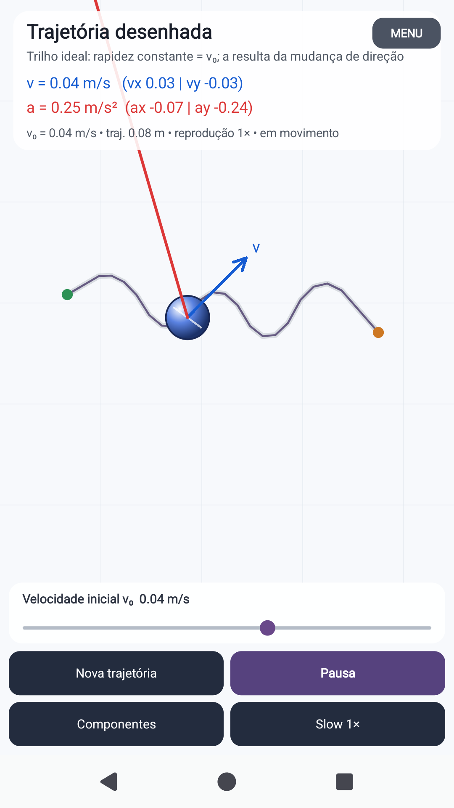
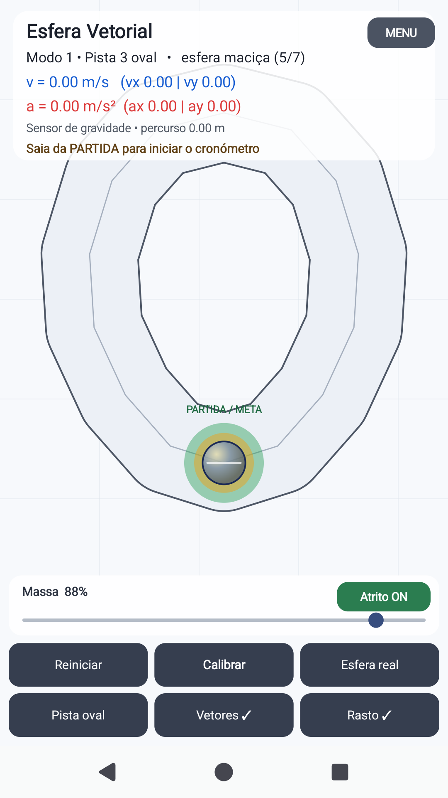

# Esfera Vetorial

**Aplicação Android educativa para explorar, de forma visual e interativa, os vetores velocidade e aceleração.**

> **Idealizado e desenvolvido por Carlos Brás @ Clube Ciência Viva Abel Salazar- junho 2026. (Programação com recurso IA).**

[⬇️ **Descarregar APK — Esfera Vetorial v0.2.2**](downloads/EsferaVetorial-v0.2.2.apk) · [🌐 **Página de divulgação**](https://cmdbras-lab.github.io/ccv-virtual-experiments/esfera-vetorial/)

## O que é

A **Esfera Vetorial** transforma o telemóvel num pequeno laboratório de movimento. A aplicação permite observar em tempo real o vetor velocidade **v**, o vetor aceleração **a** e, quando desejado, as suas componentes cartesianas.

Foi concebida para utilização didática em Física, particularmente no estudo de movimento, vetores, aceleração, movimento curvilíneo e aceleração centrípeta.

## Dois modos de utilização

### Modo 1 — Esfera livre e jogos

A esfera desloca-se no ecrã em resposta à inclinação do telemóvel.

- exploração livre;
- alvo e desafio de paragem;
- limite de velocidade;
- controlo de massa/inércia aparente;
- atrito ON/OFF;
- vetores velocidade e aceleração em tempo real;
- rasto da trajetória;
- três pistas cronometradas;
- penalização por contacto com as paredes;
- uma pista oval/circular.

### Modo 2 — Trajetória desenhada

O utilizador desenha uma trajetória diretamente no ecrã com o dedo. A aplicação suaviza a curva e faz a esfera percorrê-la como num trilho ideal.

- velocidade inicial regulável entre **0,01 e 0,06 m/s**;
- visualização permanente de **v** e **a**;
- decomposição em **vx, vy, ax e ay**;
- simulação a **1×, 1/2×, 1/4× e 1/8×**;
- pausa em qualquer ponto para análise;
- valores físicos mantidos durante o slow motion.

## Galeria

### Menu inicial

### Trajetória desenhada e vetores

### Pista oval

## Ideias físicas que podem ser exploradas

- diferença entre posição, trajetória, deslocamento e distância percorrida;
- direção e sentido do vetor velocidade;
- direção e sentido do vetor aceleração;
- situações em que velocidade e aceleração têm direções diferentes;
- decomposição vetorial segundo os eixos x e y;
- movimento retilíneo e movimento curvilíneo;
- aceleração normal/centrípeta;
- efeito do atrito e das colisões;
- análise quadro a quadro através de pausa e slow motion.

## Instalação no Android

1. Descarregar o ficheiro APK pelo botão acima.
2. Abrir o APK no telemóvel Android.
3. Se o Android solicitar, autorizar temporariamente a instalação de aplicações provenientes dessa origem.
4. Instalar e abrir **Esfera Vetorial**.

A versão disponibilizada aqui é uma aplicação educativa em desenvolvimento e não é distribuída através da Google Play Store.

## Código-fonte

O projeto Android encontra-se na pasta [`android`](android/). A compilação automática do APK é realizada por GitHub Actions.

## Autoria

**Idealizado e desenvolvido por Carlos Brás @ Clube Ciência Viva Abel Salazar- junho 2026. (Programação com recurso IA).**

## Licença

Código disponibilizado sob licença MIT. Consulte [LICENSE](LICENSE).
