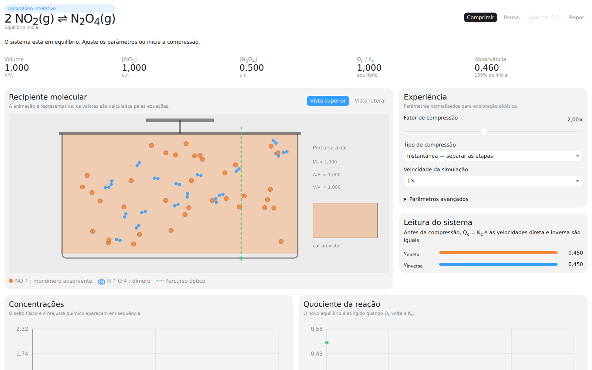
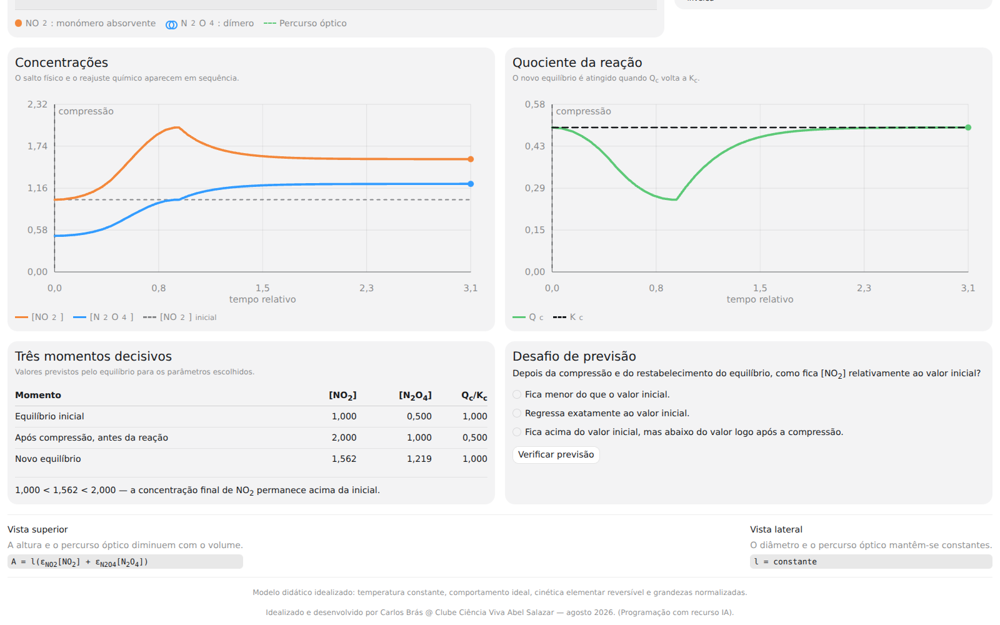
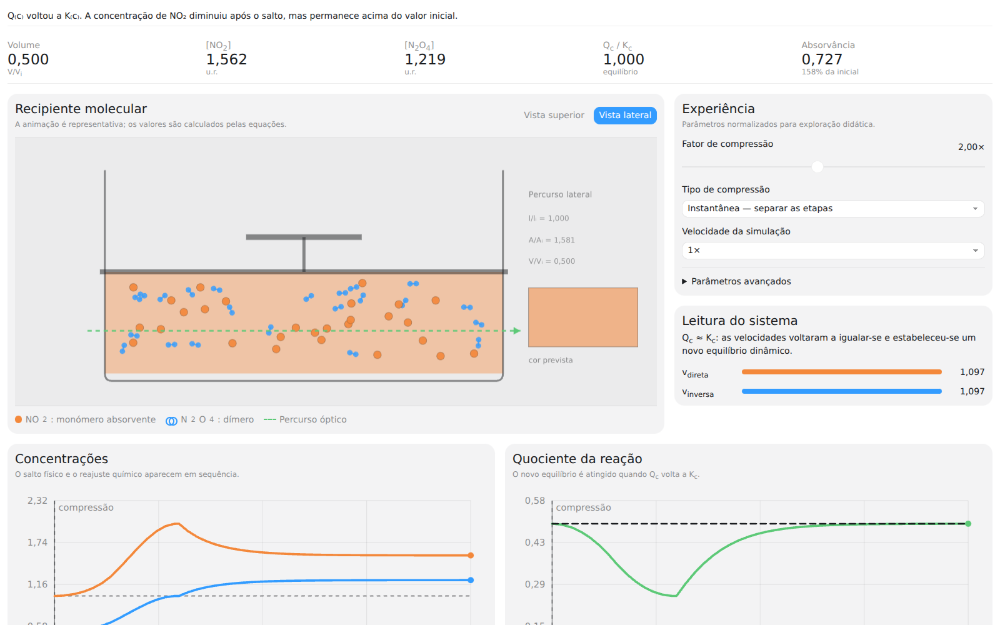

# Laboratório NO₂ ⇌ N₂O₄

Aplicação educativa interativa para explorar a compressão isotérmica do equilíbrio

\[
2\,NO_2(g) \rightleftharpoons N_2O_4(g).
\]

> **Idealizado e desenvolvido por Carlos Brás @ Clube Ciência Viva Abel Salazar — agosto 2026. (Programação com recurso IA).**

[🧪 **Experimentar no navegador**](https://cmdbras-lab.github.io/ccv-virtual-experiments/laboratorio-no2-n2o4/app/) · [🌐 **Página de divulgação**](https://cmdbras-lab.github.io/ccv-virtual-experiments/laboratorio-no2-n2o4/) · [⬇️ **Descarregar v1.0.0**](https://cmdbras-lab.github.io/ccv-virtual-experiments/laboratorio-no2-n2o4/downloads/Laboratorio-NO2-N2O4-v1.0.0.zip)

## O que permite observar

- equilíbrio inicial entre NO₂ e N₂O₄;
- compressão instantânea ou gradual do recipiente;
- salto físico imediato das concentrações e reajuste químico posterior;
- evolução de \([NO_2]\), \([N_2O_4]\), \(Q_c/K_c\) e velocidades direta/inversa;
- representação molecular animada sincronizada com o modelo matemático;
- comparação da absorvância nas vistas superior e lateral;
- pausa, avanço passo a passo, velocidade de simulação e parâmetros avançados;
- desafio de previsão com feedback para o aluno.

## Capturas da aplicação

### Recipiente molecular e controlos



### Gráficos e novo equilíbrio



### Vista lateral e absorvância



## Abrir a aplicação

### Online

Use a [versão publicada no GitHub Pages](https://cmdbras-lab.github.io/ccv-virtual-experiments/laboratorio-no2-n2o4/app/). Não necessita de instalação nem de conta.

### Offline

1. Descarregue `Laboratorio-NO2-N2O4-v1.0.0.zip`.
2. Descompacte o ficheiro.
3. Abra `index.html` num navegador moderno.

O ficheiro é autocontido e funciona sem ligação à Internet.

## Modelo científico

O sistema trabalha com quantidades de matéria e volume:

\[
[NO_2]=\frac{n_{NO_2}}{V}, \qquad [N_2O_4]=\frac{n_{N_2O_4}}{V}
\]

e com uma cinética elementar reversível normalizada:

\[
v=k_d[NO_2]^2-k_i[N_2O_4].
\]

Assim, a redução do volume altera imediatamente as concentrações, sem alterar as quantidades de matéria; a reação evolui depois até \(Q_c=K_c\). A animação de partículas é representativa e o resultado quantitativo vem das equações.

Consulte [`docs/modelo-cientifico.md`](docs/modelo-cientifico.md) para a fundamentação, as aproximações e os limites, e [`docs/guiao-didatico.md`](docs/guiao-didatico.md) para uma proposta de exploração em aula.

## Validação

Requer Node.js 20 ou posterior:

```bash
npm test
npm run validate
```

Os testes verificam a solução analítica do novo equilíbrio, a conservação estequiométrica, a interpretação ótica, a sintaxe do JavaScript e o funcionamento offline.

## Estrutura

```text
index.html                 aplicação completa e offline
docs/modelo-cientifico.md fundamentação e limites
docs/guiao-didatico.md    proposta de exploração em aula
scripts/validate.mjs      validação do artefacto
tests/                    testes científicos e estruturais
screenshots/              capturas reais da aplicação
downloads/                pacote pronto a descarregar
```

## Licença

Código disponibilizado sob licença MIT. Consulte [`LICENSE`](LICENSE).
